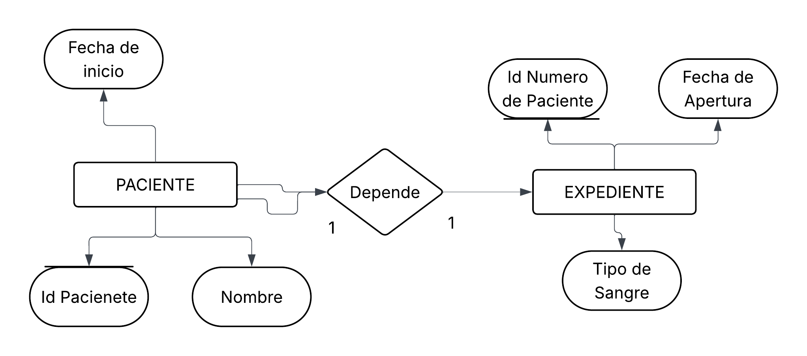
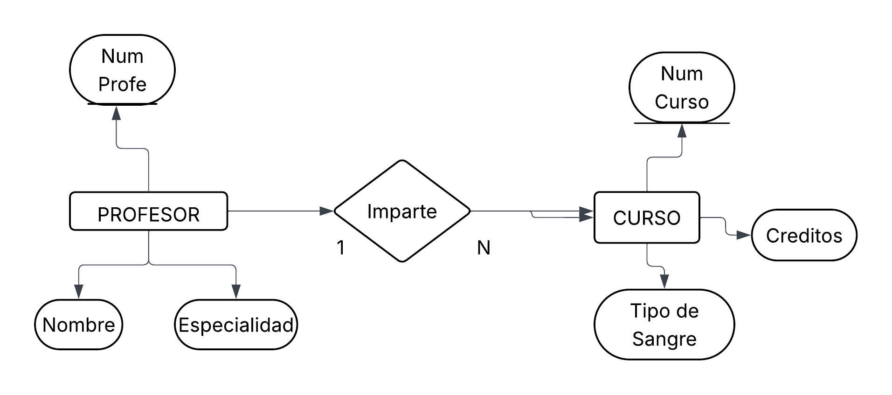
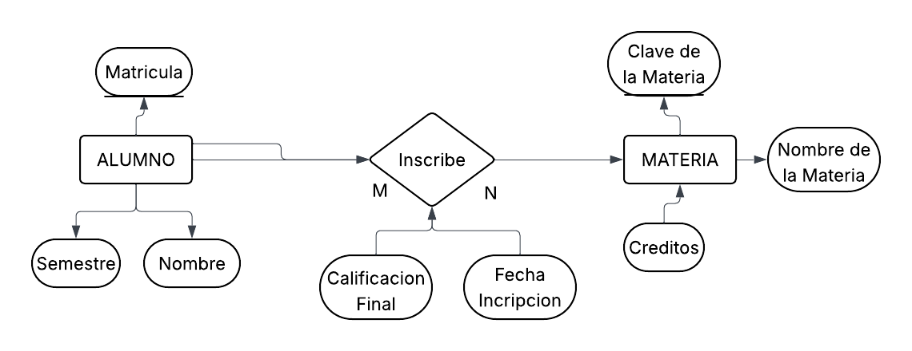
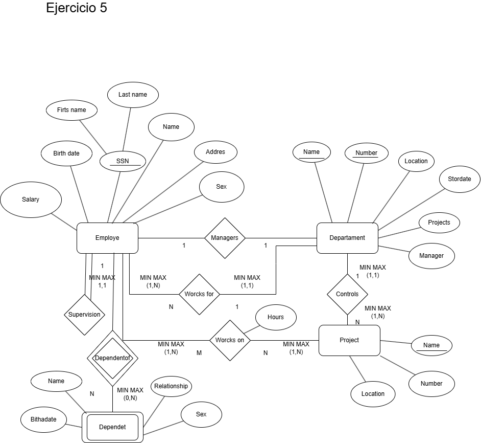

# Ejercicios del modelo entidad Relacion

## Ejercicio 1.

## Solucion de Ejercicio 1

## Ejercicio 2.
Una universidad administra profesores y cursos 

>De cada profesor se almacena:
- Numero de profesor
- Nombre
- Especialidad

>De cada curso se almacena:
- Numero de curso
- Nombre del curso
- Creditos

>Reglas del negocio:
1. Un profesor puede impartir varios cursos
2. Un curso solo puede ser 
inpartido por un profesor
3. Puede existir un profesor que 
actualmente no imparta cursos
4. Todo curso debe estar asignado 
a un profesor 

>Lo que se debe realizar: 
- Identificar  Y Dibujar las Entidades
- Identificar y Dibujar la Relacion 
**IMPARTE**
- Determinar la razon de cardinalidad
- Determinar la participacion

## Solucion de Ejercicio 2

## Ejercicio 3.

Una escuela administra alumnos y materias

>De cada alumno se almacena:

- Matricula
- Nombre
- Semestre

>De cada Materia se almacena:
- Clave de la Materia
- Nombre de la materia 
- Creditos

>Reglas del Negocio
1. Un alumno puede inscribirse 
en varias materias
2. Una materia puede tener muchos 
alumnos inscritos
3. Puede exisistir una materia sin 
alumnos inscritos
4. Todo alumno debe estar inscrito en 
almenos una materia
5. De cada inscripcion se desea almacenar: 

    - Fecha de inscripcion
    - Calificacion Final

Nota: la relacion se debe llamar  
**INSCRIBE**

## Solucion de Ejercicio 3

## Ejercicio 4
Una empresa se dedica a la veta  al por mayor y necesita registrar lo siguiente

> De los clientes necesita almacenar
- Identificor del cliente
- Nombre del cliente, el cual es una persona moral

> De los productos
- Numero del producto
- Nombre del prodcuto
- Precio del producto

> De los pedidos de Venta:
- Numero de pedidos
- Fecha del pedido

> Reglas del negocio

1. Un cliente puede realizar muchos pedidos
2. Cada pedido pertenece a un solo cliente
3. Un pedido contiene varios prductos
4. Un producto puede aparacer en muchos pedidos
5. Un pedido debe contener almenos un producto
6. Un producto puede no haber sido vendido
7. El detalle del pedido no existe sin pedido
8. El detalle del pedido no existe sin producto 
9. El detalle del pedido almacena cantidad vendidad y precio de venta
## Ejercicio 4

## Solucion de Ejercicio 4

## Ejercicio 5

## Solucion Ejercicio 5

## Ejercicio 6

## Solucion Ejercicio 6

