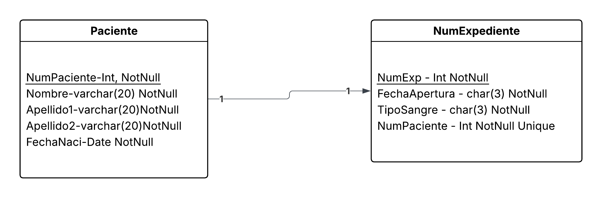
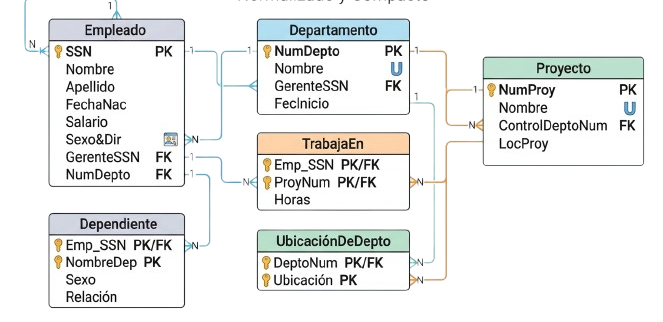

# Ejercicios del modelo Relacional

## Solucion de Ejercicio 1

## Solucion de Ejercicio 2

## Solucion de Ejercicio 3

## Solucion de Ejercicio 4

## Solucion de Ejercicio 5

## Solucion de Ejercicio 6

## Solucion de Ejercicio 7

